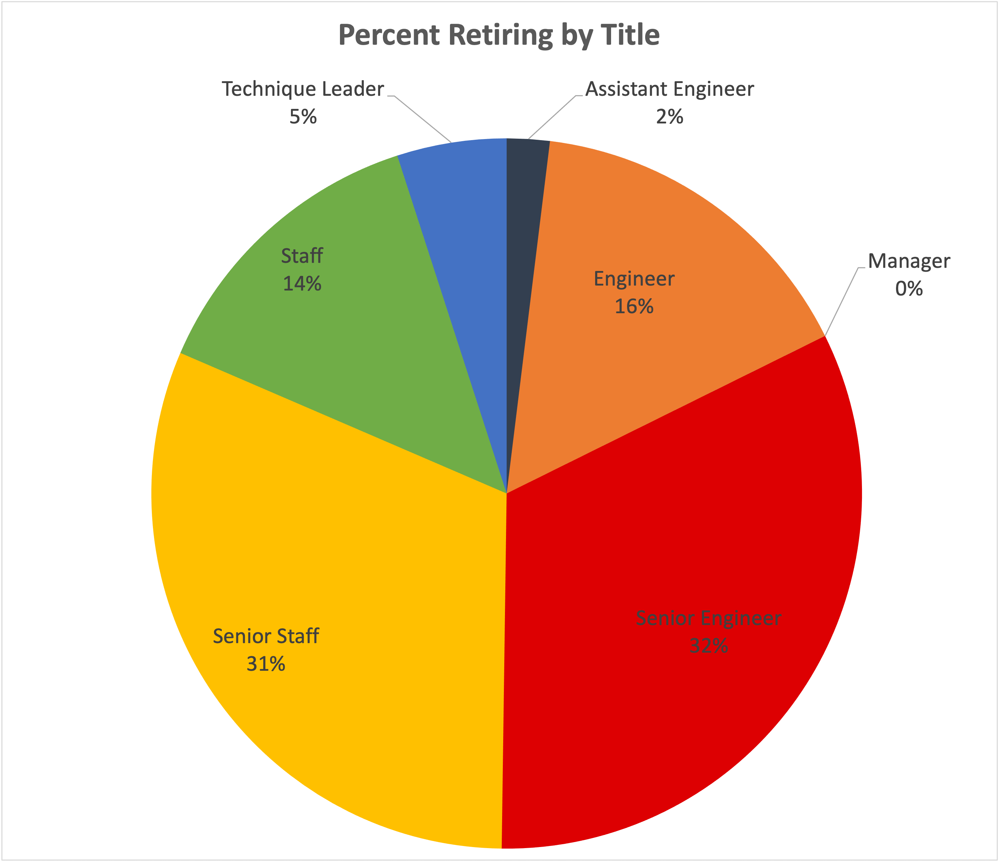
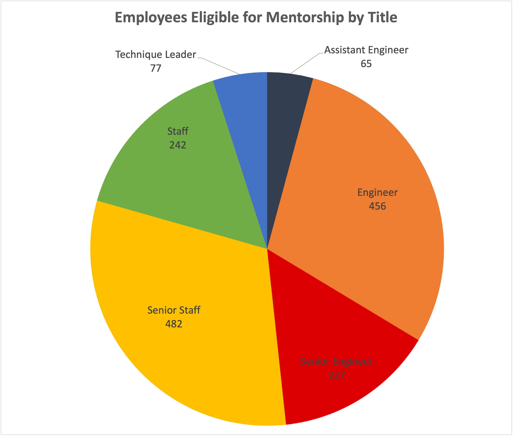

# Pewlett-Hackard-Analysis

## Overview + Purpose
In order to prepare Pewlett Hackard for the "silver tsunami," we have determined the number of employees who are retiring (per title) as well as the number of employees who are eligible to participate in the proposed mentorship program. The results of the analysis will help Pewlett Hackard management 

## Results

- Of all the retiring employees, there are no managers that are eligible for the mentorship program. This isn't a major concern because there are only two "manager" titles opening up, making up less than 1% of the retiring employees overall.
- Almost 30% of the employees who are eligible to be mentors have the title "Engineer," but engineers only make up 16% of all the retiring employees.
- Senior Engineers make up 32% of retiring employees, but less than half of them (approx. 15%) are eligible to be mentors.
- The graphs show that the sections for Senior Staff, Staff, Technical Staff, and Assistant Engineers are similarly sized (respectively) across both groups-- those retiring and those who are retiring and eligible to be mentors. 

## Summary:
How many roles will need to be filled as the "silver tsunami" begins to make an impact? 
- There could potentially be 90k roles opening up.

Are there enough qualified, retirement-ready employees in the departments to mentor the next generation of Pewlett Hackard employees? 
- Most departments have enough employees who are eligible to be mentors. The one area of concern is Senior Engineers.

We suggest making two additional queries of the data to gain more insight into the "silver tsunami:"
1. How many employees are eligible to be mentors and are also "cross-trained" (have been part of multiple departments)?
2. How many current employees who are NOT eligible to retire could be considered eligible for a promotion into one of the opening positions? (hiring from within)
